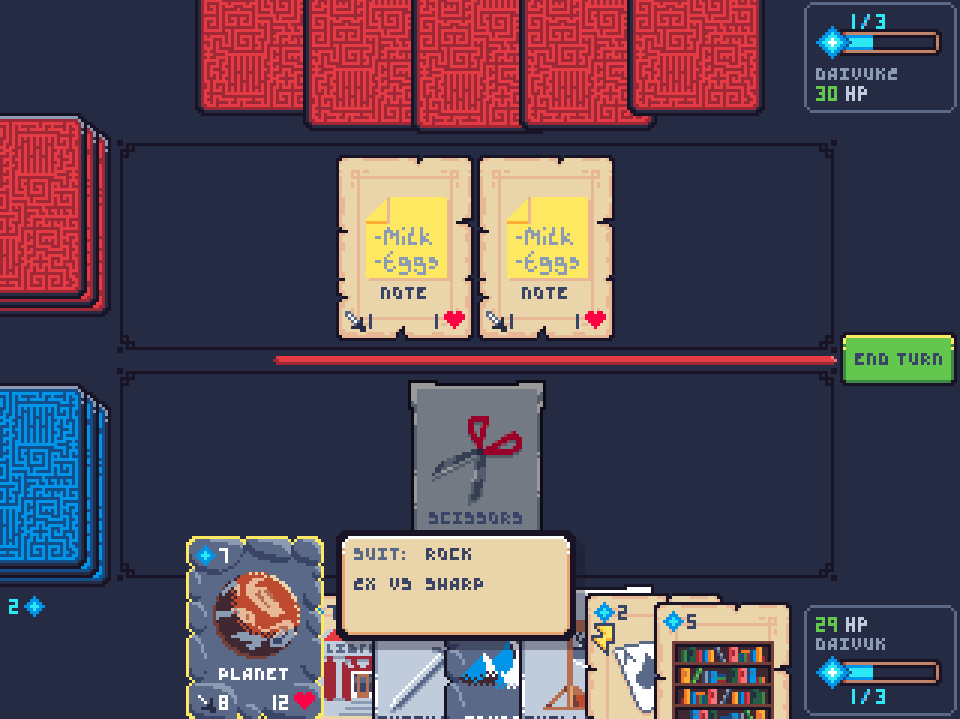

# Room Server Manager #

This Room Server Manager (RSM) is also running it's RoomServers (RS) inside the same instance. It's been done this way for simplicity of the example.

The game this hosts is **War Stone**, another brainCloud RTT example.


New test games can be added to this RSM in RoomServerManager.js:

```
switch (room.appId)
{
    case "22819":
        roomServer = new TurnBasedRoomServer(room, "WarStone");
        break;
    default:
        return null;
}
```

`TurnBasedRoomServer` is also re-usable for turn-based games.